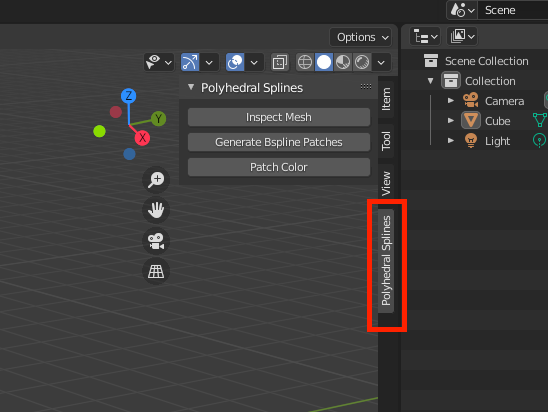

[**Polyhedral splines**](https://github.com/UF-CISE-Surflab/blender-polyhedral-splines) is a [Blender](https://www.blender.org/) [add-on](https://docs.blender.org/manual/en/latest/editors/preferences/addons.html) that converts quad-dominant meshes into B-spline patches.
This enables artists to edit spline surfaces in real-time via the existing polyhedral modeling capabilities of Blender.

Please find detailed introduction [here](https://uf-cise-surflab.github.io/blender-polyhedral-splines/)!

# Features
1. Smooth surfaces without subdividing the mesh. (The Blender's default [subdivision](https://docs.blender.org/manual/en/latest/modeling/modifiers/generate/subdivision_surface.html) and [smooth](https://docs.blender.org/manual/en/latest/modeling/modifiers/deform/smooth.html) operator exponentially increase the number of vertices. This can cause high computational and storage overhead for downstream operations)
2. Easy, exact computation of moments, e.g. volume, center of mass, axes of inertia, ...
3. Preserves the polyhedral character of the input (Low-degree splines generalize bi-2, bi-quadratic, splines. Bi-2 splines are by default less smooth than bi-3 splines, and curvature changes more sharply.)

    
    

# Installation
1. Download [Polyhedral splines repo](https://bitbucket.org/surflab/blender-polyhedral-splines/src/cleanup/) as add-on .zip file
2. Follow [official add-on installation guide](https://docs.blender.org/manual/en/latest/editors/preferences/addons.html).

# How to find the installed add-on in Blender?
Click on the small left angle bracket to expand the panel

Then switch to the tab of interactive modeling

&nbsp;&nbsp;

# How to use it?
## Mesh inspection
Select the mesh object and click "Inspect mesh" to highlight the connectivity not supported by our algorithm.

  
  

> If fixing connectivity is tricky: one  step of Catmull-Clark subdivision always yields a supported configuration

&nbsp;

## B-spline patch generaton
Select the mesh object and click "Generate Bspline Patches" to generate multiple patch objects.

> This may take a few seconds for a larger mesh due to Blender's structure creation overhead.

> Please make sure axis of import mesh is Y-forward & Z-up. Otherwise patches are not aligned with the mesh.

  
  

&nbsp;

## Interactive modeling
Now the user can drag the control points to edit the shape in real-time.

  
  

&nbsp;

### Show / Hide boundary of patches
Expand "Viewport Shading" and (dis)select "Outline".

  
  
  

&nbsp;

### Show / Hide faces of control polygon
Click on "View" then "Toggle Mesh Faces" to hide/show the semi-transparent control polyhedron ( = input polyhedron).

  
  
  

&nbsp;

### Hide patch objects
Filter out the patch objects and keep the control polygon in the scene collection list. (This does not affect the display.)

  
  
  

&nbsp;

## Patch coloring
Set color for patches generated by different configurations.

  
  

&nbsp;&nbsp;

# Implemented algorithms

1. Karčiauskas, K., & Peters, J. (2015). Smooth multi-sided blending of biquadratic splines. *Computers & Graphics*, 46, 172-185.
2. Karčiauskas, K., & Peters, J. (2020). Smooth polar caps for locally quad-dominant meshes. *Computer Aided Geometric Design*, 81, 101908.
3. Karčiauskas, K., & Peters, J. (2020). Low degree splines for locally quad-dominant meshes. *Computer Aided Geometric Design*, 83, 101934.
